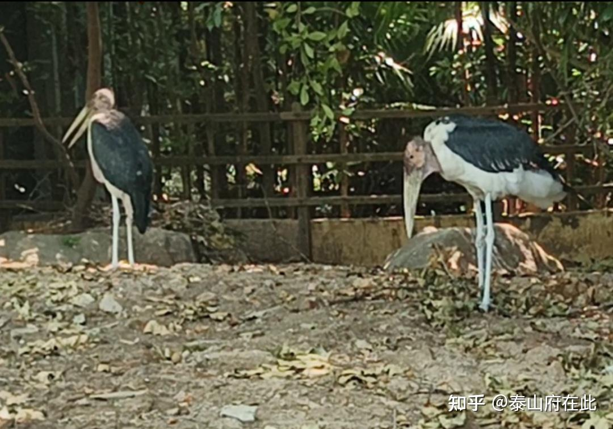

## 在线阅读站

- Netlify: https://cn-nonsense.netlify.app/
- Cloudflare Pages: https://cn-nonsense.pages.dev/

## GitHub 章节目录（Markdown）

总目录：<https://github.com/KenXiao1/cn-nonsense/tree/main/src/content/chapters/book-1>

| 章节 ID   | 标题                       | GitHub Markdown                                                                                  |
| --------- | -------------------------- | ------------------------------------------------------------------------------------------------ |
| `b1-c001` | 开幕：21世纪大审判         | [查看](https://github.com/KenXiao1/cn-nonsense/blob/main/src/content/chapters/book-1/b1-c001.md) |
| `b1-c002` | 第二幕：都他妈骗老子       | [查看](https://github.com/KenXiao1/cn-nonsense/blob/main/src/content/chapters/book-1/b1-c002.md) |
| `b1-c003` | 第三幕：在故乡             | [查看](https://github.com/KenXiao1/cn-nonsense/blob/main/src/content/chapters/book-1/b1-c003.md) |
| `b1-c004` | 第四幕：离乡小记           | [查看](https://github.com/KenXiao1/cn-nonsense/blob/main/src/content/chapters/book-1/b1-c004.md) |
| `b1-c005` | 第五幕：双城记             | [查看](https://github.com/KenXiao1/cn-nonsense/blob/main/src/content/chapters/book-1/b1-c005.md) |
| `b1-c006` | 第六幕：张天仇其人         | [查看](https://github.com/KenXiao1/cn-nonsense/blob/main/src/content/chapters/book-1/b1-c006.md) |
| `b1-c007` | 第七幕：异乡来客           | [查看](https://github.com/KenXiao1/cn-nonsense/blob/main/src/content/chapters/book-1/b1-c007.md) |
| `b1-c008` | 第八幕：这哥们真有点那啥了 | [查看](https://github.com/KenXiao1/cn-nonsense/blob/main/src/content/chapters/book-1/b1-c008.md) |
| `b1-c009` | 第九幕：世说新语           | [查看](https://github.com/KenXiao1/cn-nonsense/blob/main/src/content/chapters/book-1/b1-c009.md) |
| `b1-c010` | 第十幕：大卑琐             | [查看](https://github.com/KenXiao1/cn-nonsense/blob/main/src/content/chapters/book-1/b1-c010.md) |
| `b1-c011` | 第十一幕：头发跟蹦蹦床一样 | [查看](https://github.com/KenXiao1/cn-nonsense/blob/main/src/content/chapters/book-1/b1-c011.md) |
| `b1-c012` | 第十二幕：天注定           | [查看](https://github.com/KenXiao1/cn-nonsense/blob/main/src/content/chapters/book-1/b1-c012.md) |
| `b1-c013` | 第十三幕：史上最大规模冲突 | [查看](https://github.com/KenXiao1/cn-nonsense/blob/main/src/content/chapters/book-1/b1-c013.md) |
| `b1-c014` | 第十四幕：史前史           | [查看](https://github.com/KenXiao1/cn-nonsense/blob/main/src/content/chapters/book-1/b1-c014.md) |

简介：《全中国最激烈故事》，本书内容就如书名所言，它是关于当代中国的活生生的故事，罕见的真正的现实主义文学，不是什么流水线网文。内容够劲、够荒诞而且够爆笑，老少咸宜，一下就让人读进去，可以说是真正关涉到我们这一代人的文学，描写一群失败失意的当代年轻人荒诞、张狂、彷徨、冲创的生活，文笔通俗而又不失深意，实在是适合茶余饭后打开猛看。毕竟大家都知道，在当代，真正关于这个时代的故事还是太少了，更何况是如此激烈、如此挣扎着要表述时代精神的故事？

作者把之前写的《无标题艺术》各大内容经过大刀阔斧的修改，取了更激烈的名字，直接改写成一整本书，做成pdf。相比于拉选时期对“leftist”的描绘，作者现在更进一步，视角更加宏观，题材更加普遍，所触及到的群体更加之多，打造更真实、更社会、更神圣体验！总之祝大伙新年快乐！ [蓝奏云优享版](https://www.ilanzou.com/s/jCnnPSlv)玛德链接看这里！

再次简介：大家期待已久的《无标题艺术》单行本终于来了！现如今它已经改名为《全中国最激烈故事》，并且经由老子大刀阔斧的修改，它现在已经无敌了！我推荐所有战神都重读一遍，它的整体故事结构更加成熟完美！内容更丰富！

简而言之，这是一部当代中国空前绝后的现实主义小说，题材新颖，笔墨真实！大家如果喜欢看，记得发给身边也患有战神综合征的朋友们！

再次感谢 [@黒木](https://www.zhihu.com/people/c80bbd852be3f47255d00f5dde7096bb) 做的链接。

链接：
 
蓝奏云：https://www.ilanzou.com/s/iZEnPF4s
 
夸克：https://pan.quark.cn/s/3c8bf6e87cb0
 
百度网盘：https://pan.baidu.com/s/1UNrYHvtn64X_RWTC0wrj8A 提取码: bn8g
 
蓝奏云：https://www.ilanzou.com/s/jCnnPSlv
 
夸克：https://pan.quark.cn/s/1685c9c57c31
 
百度网盘：https://pan.baidu.com/s/1nzkh47y-RGxqL4VndQcWpw 提取码: auv9
 
分为有压缩包的和无压缩包的，诸君可自取！

我牙齿上破了个洞，我舔个不停，而且越舔越难受了！

